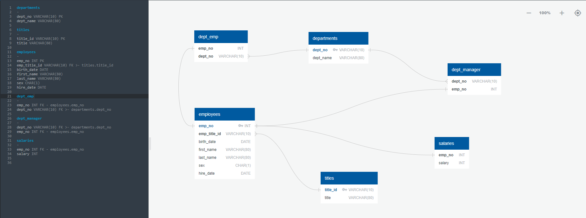

# sql-challenge
## Module 9 Challenge
For this project I analyzed a company's employee data CSV files from the 1980s and 1990s. To do this I designed tables to hold the data from the CSV files, imported the CSV files into a SQL database, and then answered the company's questions about the data. 

## Data Modeling
To model the data used for this project I made an Entity Relationship Diagram of the tables using QuickDBD. Below is an image showing the relationships between the tables used for this project.

## Data Engineering
The tabel schema for each of the six CSV files were created using SQL. Data types, primary keys, foreign keys, composite keys, and other constraints were included in the table schemata. Each of the tables were created in the correct order to be able to handle the foreign keys. The CSV files were then imported into their corresponding tables. You can view the code used to create the tables [here](EmployeeSQL/table_schemata.sql).

## Data Analysis
The following questions were asked and answered using the SQL queries you can find [here](EmployeeSQL/queries.sql).

1. List the employee number, last name, first name, sex, and salary of each employee.

2. List the first name, last name, and hire date for the employees who were hired in 1986.

3. List the manager of each department along with their department number, department name, employee number, last name, and first name.

4. List the department number for each employee along with that employee’s employee number, last name, first name, and department name.

5. List first name, last name, and sex of each employee whose first name is Hercules and whose last name begins with the letter B.

6. List each employee in the Sales department, including their employee number, last name, and first name.

7. List each employee in the Sales and Development departments, including their employee number, last name, first name, and department name.

8. List the frequency counts, in descending order, of all the employee last names (that is, how many employees share each last name).